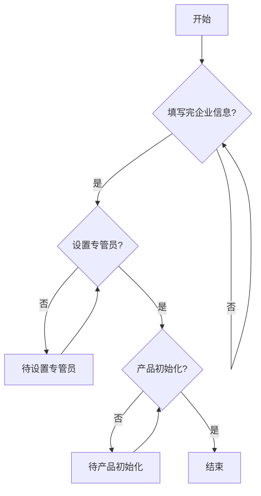
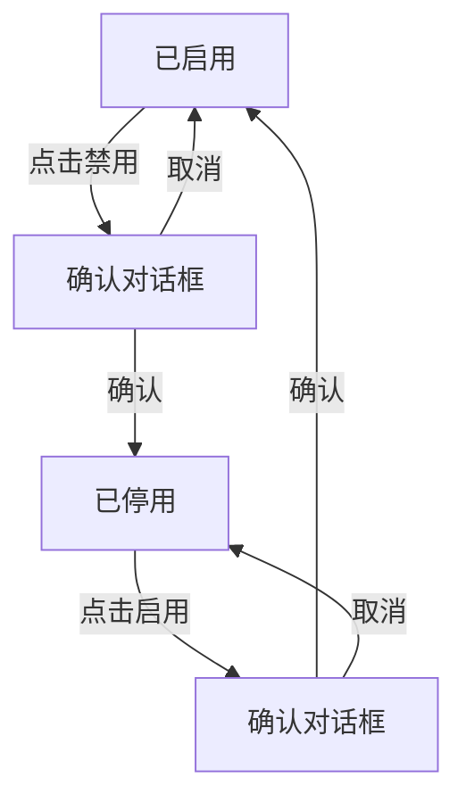
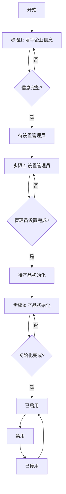
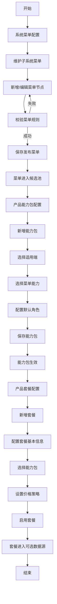
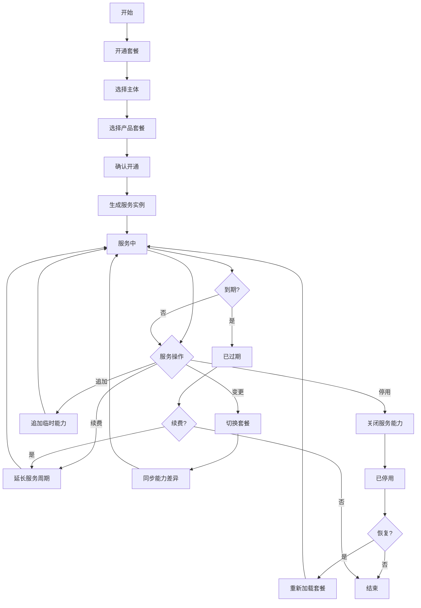
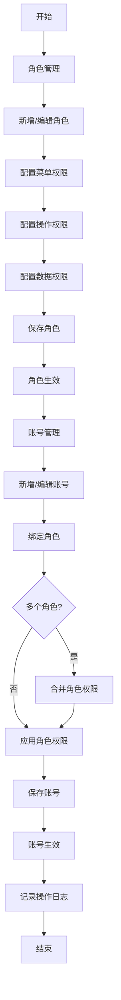
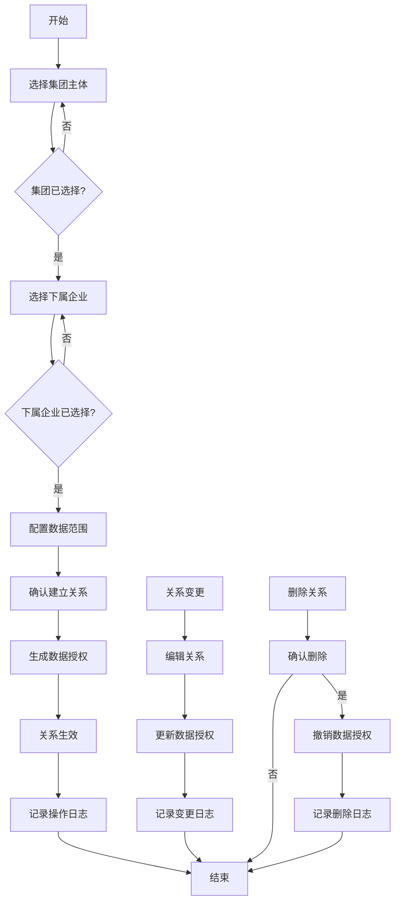
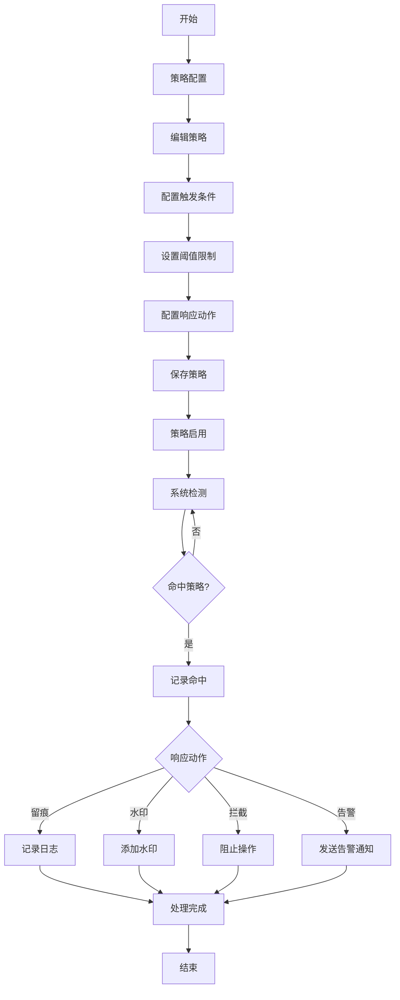

# 从业通运维端重构需求文档

## 1. 文档信息

| 项目 | 内容 |
| --- | --- |
| 文档版本 | v3.0 |
| 更新日期 | 2026-05-21 |
| 适用范围 | 从业通运维端原型与后续产品设计、研发、测试 |
| 目标用户 | 平台超级管理员、运维人员、产品运营、实施交付人员 |
| 原型入口 | `admin/index.html` |

## 2. 产品定位

从业通运维端是平台级后台，用于统一管理主体入驻、产品套餐、套餐服务、权限授权、主体关系、安全策略和基础配置。

核心目标：

- 让企业、集团、机构等主体可以被标准化入驻。
- 让平台菜单能力沉淀为产品能力包，再由能力包组成产品套餐。
- 让主体开通套餐后形成可运营的服务实例。
- 让运维人员围绕服务实例完成开通、续费、变更、追加、停用、恢复和记录追溯。
- 让权限、菜单、安全策略和主体关系具备可配置、可追溯、可审计能力。

## 3. 角色与权限边界

| 角色 | 核心职责 |
| --- | --- |
| 超级管理员 | 管理系统菜单、产品能力包、产品套餐、权限策略、账号角色、主体关系 |
| 运维人员 | 处理主体入驻、套餐开通、服务实例维护、运营记录查询 |
| 产品运营 | 配置能力包、套餐价格、套餐状态、服务策略和开通规则 |
| 实施人员 | 跟进企业入驻进度、补齐企业资料、协助完成套餐开通 |
| 审计人员 | 查看安全策略命中、服务记录、权限变更和主体关系变更 |

## 4. 信息架构

运维端一级模块：

- 企业管理
- 用户管理
- 产品配置
- 权限与授权中心
- 风险与安全中心
- 基础配置

重点重构模块：

- 企业列表与企业入驻
- 菜单配置与菜单维护
- 产品能力包
- 产品套餐管理
- 套餐服务管理
- 运营记录
- 角色权限与账号权限
- 主体关系
- 安全策略

## 5. 核心业务流程

### 5.1 企业入驻流程

业务目标：

将企业、集团、培训机构等主体纳入平台，并在入驻过程中完成企业信息填写、专管员设置和产品初始化。

业务流程图：

流程：

1. 运维人员在企业列表点击新增企业，开始入驻流程。
2. 第一步检查企业信息是否填写完成，未完成则继续填写。
3. 企业信息填写完成后，检查是否设置专管员。
4. 未设置专管员时，状态为"待设置专管员"，可继续设置。
5. 专管员设置完成后，检查产品是否初始化。
6. 产品未初始化时，状态为"待产品初始化"，可继续初始化。
7. 所有步骤完成后，入驻流程结束。

企业列表字段：

| 字段 | 说明 |
| --- | --- |
| 企业名称 | 主体全称 |
| 企业类型 | 煤矿企业、煤矿集团、机构 |
| 行业类型 | 煤矿行业、非煤矿行业 |
| 省份/城市/县区 | 主体所在地区 |
| 状态 | 已启用、待设置管理员、待产品初始化、已停用 |
| 操作 | 详情、编辑、产品服务、启用/禁用、产品初始化、设置管理员 |

状态说明：
- **启用/禁用互斥**：企业状态为启用或禁用，禁用的企业不能登录从业通系统
- **无已过期状态**：企业状态只有启用、停用、待设置管理员、待产品初始化四种
- **企业启用前提**：必须完成企业入驻（企业信息填写 + 设置管理员 + 产品初始化）才能启用企业

入驻完成条件：
1. 企业信息填写完成
2. 管理员账号设置完成
3. 产品初始化完成

状态与操作关系：

| 状态 | 可执行操作 | 说明 |
| --- | --- | --- |
| 已启用 | 详情、编辑、产品服务、禁用 | 已完成入驻，可正常运营 |
| 待设置管理员 | 详情、编辑、设置管理员 | 未完成入驻，需先设置管理员 |
| 待产品初始化 | 详情、编辑、产品初始化 | 未完成入驻，需先完成产品初始化 |
| 已停用 | 详情、编辑、产品服务、启用 | 已完成入驻但已停用，可重新启用 |

操作说明：
- **详情**：查看企业详细信息
- **编辑**：编辑企业基础信息（跳转到入驻向导步骤1）
- **产品服务**：查看产品服务状态和套餐信息
- **启用**：启用企业，允许登录从业通系统（仅对已停用状态可用）
- **禁用**：禁用企业，禁止登录从业通系统（仅对已启用状态可用）
- **设置管理员**：点击后跳转至入驻向导步骤2，完成管理员账号设置
- **产品初始化**：点击后跳转至入驻向导步骤3，完成产品能力配置

启用/禁用交互逻辑：

**禁用操作**
- 触发条件：企业状态为"已启用"
- 操作入口：点击操作列的"禁用"按钮
- 确认提示：弹出确认对话框，提示"确定要禁用企业[企业名称]吗？禁用后，该企业将无法登录从业通系统。"
- 确认后操作：
  1. 企业状态更新为"已停用"
  2. 状态标签样式更新为已停用样式
  3. 操作列的"禁用"按钮变为"启用"按钮
  4. 显示成功提示："企业已禁用"

**启用操作**
- 触发条件：企业状态为"已停用"
- 操作入口：点击操作列的"启用"按钮
- 确认提示：弹出确认对话框，提示"确定要启用企业[企业名称]吗？启用后，该企业将可以正常登录从业通系统。"
- 确认后操作：
  1. 企业状态更新为"已启用"
  2. 状态标签样式更新为已启用样式
  3. 操作列的"启用"按钮变为"禁用"按钮
  4. 显示成功提示："企业已启用"

**操作限制**
- 只有已完成入驻的企业（已启用或已停用状态）才能进行启用/禁用操作
- 未完成入驻的企业（待设置管理员、待产品初始化状态）点击启用/禁用按钮时，弹出提示："只有已完成入驻的企业才能进行启用/禁用操作"

**状态流转图**

企业入驻三步骤交互：

**步骤1：填写企业信息**
- 入口：点击"新增企业"按钮或"编辑"操作
- 内容：填写企业名称、类型、行业、地区等基础信息
- 完成后状态流转：企业信息填写完成 → 待设置管理员
- 向导标题：企业入驻向导
- 完成按钮：完成企业信息

**步骤2：设置管理员**
- 入口：点击"设置管理员"操作（仅待设置管理员状态可见）
- 内容：设置企业管理员账号（用户名、密码、联系方式）
- 完成后状态流转：待设置管理员 → 待产品初始化
- 向导标题：设置管理员
- 完成按钮：完成设置

**步骤3：产品初始化**
- 入口：点击"产品初始化"操作（仅待产品初始化状态可见）
- 内容：选择产品套餐、配置产品能力
- 完成后状态流转：待产品初始化 → 已启用
- 向导标题：产品初始化
- 完成按钮：完成初始化

入驻向导模式说明：

| 模式 | 说明 | 可访问步骤 | 标题 | 完成按钮文本 |
| --- | --- | --- | --- | --- |
| add | 新增企业 | 步骤1 | 企业入驻向导 | 完成企业信息 |
| info-edit | 编辑企业信息 | 步骤1 | 编辑企业信息 | 完成编辑 |
| admin-edit | 设置管理员 | 步骤1-2 | 设置管理员 | 完成设置 |
| init-edit | 产品初始化 | 步骤1-3 | 产品初始化 | 完成初始化 |

操作跳转规则：

| 操作 | 调用方式 | 跳转步骤 | 模式 |
| --- | --- | --- | --- |
| 新增企业 | showOnboardingWizard() | 步骤1 | add |
| 编辑企业信息 | showOnboardingWizard(1, 'edit') | 步骤1 | info-edit |
| 设置管理员 | showOnboardingWizard(2) | 步骤2 | admin-edit |
| 产品初始化 | showOnboardingWizard(3) | 步骤3 | init-edit |

状态流转图：

入驻进度规则：

- 已完成步骤显示完成状态。
- 未完成步骤显示对应待办状态（待设置专管员、待产品初始化）。
- 待完成步骤提供继续办理入口。
- 产品版本下拉每次打开入驻向导时，从套餐服务数据重新生成，避免使用过期套餐。

### 5.2 产品配置流程

产品配置包含三层对象：

1. 系统菜单配置
2. 产品能力包
3. 产品套餐

业务流程图：

#### 5.2.1 系统菜单配置

业务目标：

维护各子系统菜单资源，使菜单能力可以被产品能力包引用。

功能要求：

- 支持企业端、集团端、机构端、员工端等子系统。
- 子系统列表展示系统编码、使用对象、菜单数、首页路由、最近变更和状态。
- 进入菜单维护后，以树形结构展示菜单。
- 菜单支持一级、二级和多级子菜单。
- 菜单节点支持新增子菜单、编辑、删除。
- 顶部支持新增一级菜单。
- 保存发布后，菜单可进入产品能力包候选池。

菜单维护校验：

- 菜单名称必填。
- 同一父级下菜单名称不可重复。
- 路由必须以 `/` 开头。
- 路由全局唯一。
- 排序必须为正整数。
- 不能选择自身或下级菜单作为父级。
- 存在下级菜单时不能直接删除父级菜单。
- 存在下级菜单时不能直接变更父级，需先迁移或删除子菜单。
- 原型默认支持最多 6 级菜单。

#### 5.2.2 产品能力包

业务目标：

将菜单节点按业务能力组合成能力包，作为产品套餐的组合单元。

能力包字段：

| 字段 | 说明 |
| --- | --- |
| 能力包名称 | 如人员管理包、培训考试包、集团协同包 |
| 能力包编码 | 唯一编码，如 `ABILITY_STAFF` |
| 适用端 | 企业端、集团端、机构端、员工端 |
| 包含菜单 | 由菜单维护中沉淀的菜单节点组成 |
| 默认角色 | 开通后可初始化的角色集合 |
| 状态 | 启用、停用 |
| 说明 | 能力包边界、适用场景、开通限制 |

交互要求：

- 支持新增能力包。
- 支持编辑能力包。
- 新增/编辑共用表单弹窗。
- 表单可选择适用端、包含菜单、默认角色和状态。
- 去掉引用套餐字段，能力包不直接展示套餐引用关系。

校验规则：

- 能力包名称必填且不可重复。
- 能力包编码必填且不可重复。
- 编码以大写字母开头，仅支持大写字母、数字和下划线。
- 至少选择一个适用端。
- 至少选择一个菜单能力。
- 默认角色必填。

#### 5.2.3 产品套餐管理

业务目标：

维护平台对主体可售卖、可开通的套餐版本。

列表字段：

| 字段 | 说明 |
| --- | --- |
| 套餐名称 | 如企业标准套餐、集团协同套餐、培训机构套餐 |
| 套餐编码 | 套餐唯一编码 |
| 适用主体 | 煤矿企业、煤矿集团、培训机构 |
| 默认服务期限 | 6 个月、12 个月、24 个月 |
| 官方价格 | 新开通价格 |
| 续费价格 | 续费价格 |
| 能力配置 | 已配置、待配置 |
| 状态 | 启用、停用 |
| 操作 | 编辑、启用/停用 |

交互要求：

- 套餐管理页只保留筛选项和套餐管理列表。
- 操作项只保留编辑和启用/停用。
- 新增套餐弹窗包含套餐基本信息设置和产品能力包选择。
- 新增或编辑套餐后，同步影响企业入驻和开通套餐下拉选项。
- 停用套餐后，企业入驻与套餐开通不再展示该套餐。
- 启用套餐后，重新进入可选数据源。

## 6. 套餐服务管理

### 6.1 业务定位

套餐服务管理围绕主体当前服务实例进行运营。企业列表负责主体资料，套餐服务管理负责主体开通后的服务状态和生命周期操作。

### 6.2 服务实例生命周期流程图

### 6.3 开通套餐

业务目标：

为已有主体选择启用中的产品套餐，并生成服务实例。

交互要求：

- 开通套餐是套餐服务管理页面的操作按钮。
- 点击开通套餐后打开弹窗，不跳转页面。
- 弹窗只保留两个必填项：选择主体、选择产品套餐。
- 产品套餐下拉来源于启用状态的套餐数据。
- 选择套餐后展示能力预览和资源额度，作为辅助信息。
- 点击确认开通后生成服务实例、开通记录，并进入当前服务实例列表。

开通校验：

- 必须选择主体。
- 必须选择启用中的产品套餐。
- 已停用套餐不可被选择。
- 若主体已存在服务实例，原型可提示替换、续费或变更，后续实现需按业务策略确定。

服务实例生成内容：

- 主体名称
- 主体类型
- 当前套餐
- 服务开始时间
- 服务结束时间
- 能力数量
- 资源额度
- 服务状态
- 操作入口

### 6.3 当前服务实例

列表字段：

| 字段 | 说明 |
| --- | --- |
| 主体名称 | 企业、集团或机构名称 |
| 主体类型 | 煤矿企业、煤矿集团、培训机构 |
| 当前套餐 | 当前生效套餐 |
| 服务开始 | 服务开始日期 |
| 服务结束 | 服务结束日期 |
| 剩余天数 | 新开通、具体剩余天数、已过期 |
| 能力数 | 当前服务包含能力数量 |
| 服务状态 | 服务中、即将到期、已过期、已停用 |
| 操作 | 详情、记录、续费、变更、追加、停用、恢复 |

### 6.4 服务生命周期操作

| 操作 | 说明 |
| --- | --- |
| 详情 | 查看服务状态、套餐、资源占用和最近操作 |
| 记录 | 查看该主体运营记录 |
| 续费 | 延长服务周期，保留原套餐能力 |
| 变更 | 切换套餐并同步能力差异 |
| 追加 | 在当前套餐外追加临时能力 |
| 停用 | 关闭主体服务能力 |
| 恢复 | 重新加载套餐能力并恢复服务 |

### 6.5 运营记录

业务目标：

统一记录开通、续费、变更、追加、停用、恢复等服务动作。

交互要求：

- 运营记录合并为一个表格展示。
- 支持按主体、动作类型、时间范围、状态筛选。
- 支持快速筛选本月、近 7 天、续费、变更、异常/停用。

记录字段：

| 字段 | 说明 |
| --- | --- |
| 主体名称 | 发生操作的主体 |
| 套餐名称 | 操作时关联套餐 |
| 动作类型 | 开通、续费、变更、追加、停用、恢复 |
| 变更内容 | 本次操作核心变化 |
| 资源/权限影响 | 菜单、权限、资源额度影响 |
| 处理结果 | 成功、停用、异常等 |
| 操作时间 | 操作发生时间 |
| 操作人 | 平台运维、系统自动等 |

## 7. 权限管理

### 7.1 权限管理流程图

### 7.2 菜单与权限关系

权限管理以菜单为资源基础：

- 菜单配置定义系统可访问资源。
- 菜单维护定义多级菜单结构。
- 菜单节点可绑定按钮权限、数据权限和默认角色。
- 产品能力包引用菜单能力。
- 套餐开通后根据能力包生成主体可见菜单。

### 7.3 角色管理

功能要求：

- 支持新增、编辑、删除角色。
- 支持角色启用/停用。
- 支持为角色配置菜单权限、操作权限、数据权限。
- 默认角色可被产品能力包引用。

角色字段：

| 字段 | 说明 |
| --- | --- |
| 角色名称 | 如企业管理员、培训管理员、集团监管员 |
| 角色编码 | 唯一编码 |
| 适用端 | 企业端、集团端、机构端、运维端 |
| 权限范围 | 菜单、按钮、数据 |
| 状态 | 启用、停用 |

### 7.4 账号管理

功能要求：

- 支持新增账号、编辑账号、启用/停用账号。
- 支持绑定角色。
- 支持账号权限查看。
- 支持按姓名、手机号、状态搜索。

账号与角色关系：

- 一个账号可绑定多个角色。
- 账号最终权限为角色权限、额外授权和数据权限的组合。
- 权限变更需记录操作日志。

## 8. 主体关系管理

### 8.1 主体关系流程图

### 8.2 业务定位

主体关系用于描述集团与下属企业之间的管理关系，并影响数据授权和可见范围。

主体关系类型：

| 类型 | 说明 |
| --- | --- |
| 集团管理下属企业 | 煤矿集团管理下属集团与煤矿企业，配置可管理的数据范围 |

### 8.3 关系台账

字段：

| 字段 | 说明 |
| --- | --- |
| 集团主体 | 上级集团名称 |
| 关系类型 | 集团管理下属企业 |
| 下属企业 | 被管理的下属企业列表 |
| 数据范围 | 人事管理、宣教培训、法律服务、安全管理、设备管理、财务管理 |
| 状态 | 启用、停用 |
| 操作 | 查看、编辑、删除 |

### 8.4 关系配置

功能要求：

- 支持新增关系。
- 选择集团主体（下拉选择）。
- 选择下属企业（多选，支持搜索过滤）。
- 配置数据范围（多选，支持全选/取消全选）。
- 支持编辑已有关系。
- 支持删除关系（需二次确认）。

数据范围选项：

| 数据域 | 说明 |
| --- | --- |
| 人事管理 | 员工信息、入职管理、离职管理 |
| 宣教培训 | 培训计划、培训记录、考试管理 |
| 法律服务 | 合同管理、法律事务、合规检查 |
| 安全管理 | 安全检查、隐患排查、事故管理 |
| 设备管理 | 设备台账、维护保养、设备巡检 |
| 财务管理 | 费用管理、预算管理、报表统计 |

### 8.5 数据授权

业务规则：

- 关系建立后自动生成数据授权。
- 数据授权范围由数据域决定。
- 删除关系后，授权同步失效。
- 关系变更需写入变更记录和操作日志。

## 9. 安全策略

### 9.1 安全策略流程图

### 9.2 策略配置

业务目标：

对敏感字段、高风险动作、认证安全进行策略化控制。

页面结构：

- 策略配置
- 策略命中记录

策略配置要求：

- 去掉新增策略操作。
- 操作项为编辑。
- 编辑可修改次数限制或数据条数限制。
- 策略状态为启用。

策略字段：

| 字段 | 说明 |
| --- | --- |
| 策略名称 | 如身份证明文查看策略 |
| 策略域 | 敏感字段、高风险动作、认证安全 |
| 触发条件 | 命中策略的条件 |
| 阈值限制 | 次数、条数、频率等 |
| 响应动作 | 留痕、水印、拦截、告警 |
| 状态 | 启用 |
| 操作 | 编辑 |

### 9.3 策略命中记录

处理结果：

- 已拦截
- 拦截失败

命中记录字段：

| 字段 | 说明 |
| --- | --- |
| 时间 | 命中时间 |
| 策略 | 命中策略名称 |
| 对象 | 账号、接口、任务或主体 |
| 命中原因 | 触发策略的具体原因 |
| 风险级别 | 高、中、低 |
| 处理结果 | 已拦截、拦截失败 |
| 操作 | 查看 |

查看详情要求：

- 展示命中时间、策略、对象、处理结果。
- 展示命中说明。
- 展示处理链路。
- 展示后续建议。

## 10. 基础配置

基础配置用于维护平台运行所需的字典、流程和规则。

### 10.1 字典配置

功能要求：

- 支持行业字典。
- 支持工种职务字典。
- 支持学历、部门、职务等基础字典。
- 支持启用/停用。
- 支持字典项管理。

### 10.2 流程配置

功能要求：

- 支持企业入驻流程步骤配置。
- 支持步骤启用/停用。
- 支持步骤排序。
- 支持步骤必填字段配置。

### 10.3 系统配置

功能要求：

- 平台基本信息配置。
- 安全设置。
- 通知设置。
- 数据管理。

## 11. 状态与数据规则

### 11.1 主体状态

| 状态 | 说明 |
| --- | --- |
| 已启用 | 主体已完成入驻并可使用 |
| 待配置 | 主体信息存在，但套餐或初始化未完成 |
| 已过期 | 套餐服务已过期 |
| 已停用 | 主体或服务已停用 |

### 11.2 套餐状态

| 状态 | 说明 |
| --- | --- |
| 启用 | 可在企业入驻和开通套餐中选择 |
| 停用 | 不可新开通，不影响已开通服务实例 |

### 11.3 服务状态

| 状态 | 说明 |
| --- | --- |
| 服务中 | 当前套餐服务有效 |
| 即将到期 | 服务即将到期，需要续费跟进 |
| 已过期 | 服务已超过结束日期 |
| 已停用 | 服务能力已关闭 |

## 12. 原型下载与交付

交付文件：

- 运维端原型：`admin/index.html`
- 需求文档：`admin_requirements.md`
- 企业端原型参考：`enterprise.html`
- 说明文档：`README.md`

下载入口：

- 在套餐服务管理页面提供“下载需求文档”按钮。
- 点击后下载 `admin_requirements.md`。

## 13. 验收标准

### 13.1 企业入驻

- 新增企业向导可打开。
- 产品版本下拉来源于启用套餐。
- 入驻进度可打开并跳转待办步骤。
- 企业列表产品版本展示套餐语义。

### 13.2 产品配置

- 菜单配置可切换系统菜单配置和产品能力包。
- 菜单维护支持树形多级结构和新增/编辑/删除。
- 产品能力包支持新增和编辑。
- 产品套餐管理只保留筛选和列表。
- 套餐操作只保留编辑和启用/停用。

### 13.3 套餐服务

- 套餐服务管理页无“企业列表与套餐服务业务线”模块。
- 开通套餐为页面按钮。
- 点击开通套餐打开弹窗。
- 弹窗只需选择主体和选择套餐。
- 确认后生成服务实例和开通记录。
- 当前服务实例支持详情、记录、续费、变更、追加、停用、恢复。

### 13.4 权限与安全

- 菜单维护有逻辑校验。
- 安全策略无新增策略按钮。
- 策略操作为编辑。
- 策略命中记录处理结果为已拦截或拦截失败。
- 查看命中详情弹窗完整展示。

### 13.5 主体关系

- 主体关系台账可查看。
- 支持关系配置、数据授权、变更记录和操作日志。
- 关系类型、授权范围、数据域表达清晰。

## 14. 后续建议

- 将当前静态原型拆分为组件化页面，减少单文件复杂度。
- 将套餐、能力包、菜单树抽象为统一数据模型。
- 引入真实权限模型后，补充菜单权限、按钮权限、数据权限的联动校验。
- 将开通套餐、续费、变更、停用等动作统一纳入服务实例状态机。
- 对安全策略和主体关系增加审计日志导出能力。
