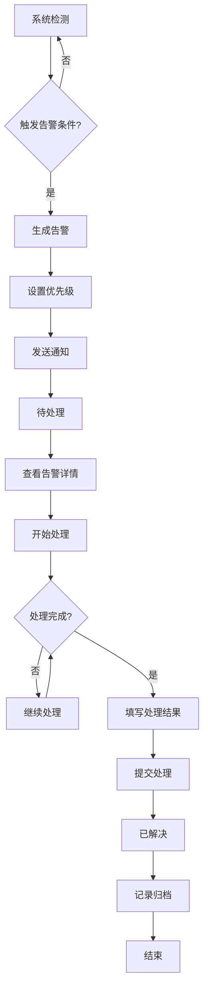
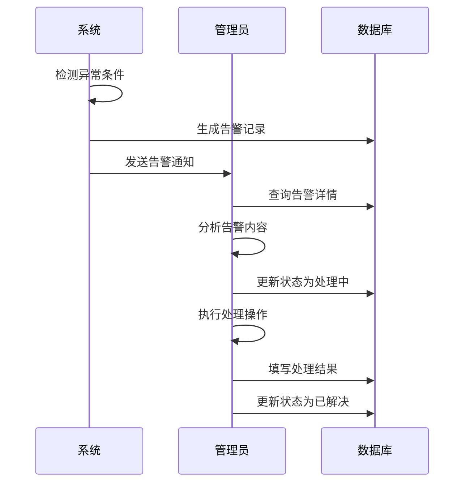
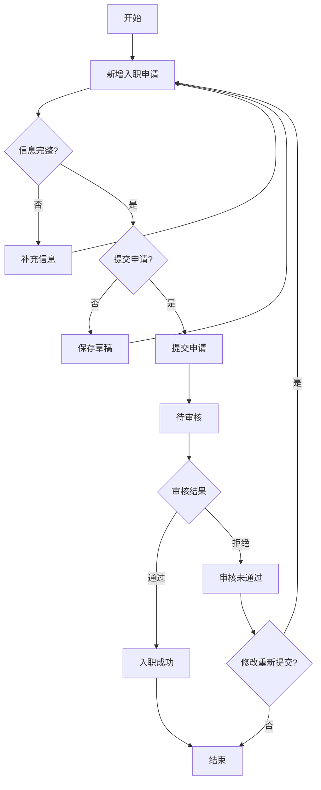

# 从业通企业端原型文档

## 1. 文档概述

本文档描述从业通企业端系统的可交互原型，基于运维端UI规范设计，包含企业入驻后企业管理员使用的核心功能模块。

---

## 2. 系统架构

### 2.1 系统定位

企业端系统是从业通平台为入驻企业提供的管理后台，供企业管理员进行日常运营管理。

### 2.2 功能模块

| 模块 | 功能说明 | 状态 |
|------|----------|------|
| 企业信息 | 展示企业入驻时填写的基本信息 | ✅ |
| 告警管理 | 监控和处理各类告警通知 | ✅ |
| 入职管理 | 管理员工入职申请流程 | ✅ |
| 人事管理 | 管理企业员工信息 | ✅ |
| 人员档案 | 管理员工档案资料 | ✅ |
| 系统设置 | 配置企业系统参数 | ✅ |

---

## 3. 页面设计

### 3.1 整体布局

```
┌─────────────────────────────────────────────────────────────┐
│ 侧边栏导航 │                    主内容区                      │
│ ┌─────────┐ │  ┌─────────────────────────────────────────┐ │
│ │ 告警管理 │ │  │ 页面标题                                │ │
│ │ 入职管理 │ │  │ 页面副标题                              │ │
│ │ 人事管理 │ │  └─────────────────────────────────────────┘ │
│ │ 人员档案 │ │                                             │
│ │ 企业信息 │ │  ┌─────────────────────────────────────────┐ │
│ │ 系统设置 │ │  │ 内容区域                               │ │
│ └─────────┘ │  │                                         │ │
│ ┌─────────┐ │  │                                         │ │
│ │ 用户信息 │ │  │                                         │ │
│ │ 退出登录 │ │  └─────────────────────────────────────────┘ │
│ └─────────┘ │                                             │
└─────────────┴───────────────────────────────────────────────┘
```

### 3.2 页面清单

| 页面ID | 页面名称 | 功能描述 |
|--------|----------|----------|
| page-alarm | 告警管理 | 告警统计、告警列表、告警处理 |
| page-onboard | 入职管理 | 入职申请列表、新增入职、审核操作 |
| page-hr | 人事管理 | 员工列表、员工统计、状态管理 |
| page-archive | 人员档案 | 档案详情、文件管理、变动记录 |
| page-enterprise | 企业信息 | 企业基本信息、联系信息、入驻信息 |
| page-system | 系统设置 | 基本设置、安全设置、通知设置、数据管理 |

---

## 4. 企业信息模块

### 4.1 功能说明

展示企业入驻时填写的信息，与运维端企业入驻流程数据保持一致。

### 4.2 数据字段

| 字段分类 | 字段名称 | 数据示例 |
|----------|----------|----------|
| 基本信息 | 企业名称 | 贵州XX煤矿有限公司 |
| 基本信息 | 企业简称 | XX煤矿 |
| 基本信息 | 统一信用代码 | 91520000XXXXXXXXXXXX |
| 基本信息 | 企业类型 | 煤矿企业 |
| 基本信息 | 产品版本 | 企业版 |
| 基本信息 | 所属地区 | 贵州省六盘水市 |
| 联系信息 | 联系人 | 张三 |
| 联系信息 | 联系电话 | 138****8888 |
| 联系信息 | 电子邮箱 | contact@xxcoal.com |
| 联系信息 | 企业地址 | 贵州省六盘水市XX区XX路XX号 |
| 入驻信息 | 入驻状态 | 已启用 |
| 入驻信息 | 创建时间 | 2026-01-15 10:30:00 |
| 入驻信息 | 开通时间 | 2026-01-16 09:00:00 |
| 入驻信息 | 到期时间 | 2027-01-15 23:59:59 |

### 4.3 页面结构

```
企业信息页面
├── 面包屑导航
├── 企业卡片（企业名称、状态标签）
├── 基本信息区块
│   ├── 企业名称
│   ├── 企业简称
│   ├── 统一信用代码
│   ├── 企业类型
│   ├── 产品版本
│   └── 所属地区
├── 联系信息区块
│   ├── 联系人
│   ├── 联系电话
│   ├── 电子邮箱
│   └── 企业地址
├── 入驻信息区块
│   ├── 入驻状态
│   ├── 创建时间
│   ├── 开通时间
│   └── 到期时间
└── 企业数据概览
    ├── 员工总数
    ├── 档案归档数
    ├── 待处理告警
    └── 待办事项
```

---

## 5. 告警管理模块

### 5.1 功能说明

监控企业各类告警信息，支持查看和处理告警。

### 5.2 告警业务流程图



### 5.3 告警类型

| 类型 | 描述 |
|------|------|
| 人事告警 | 员工合同到期、证书过期等 |
| 培训告警 | 培训证书即将过期 |
| 安全告警 | 安全隐患提醒 |
| 健康告警 | 体检到期提醒 |

### 5.4 告警状态

| 状态 | 说明 |
|------|------|
| 待处理 | 告警已生成，等待处理 |
| 处理中 | 正在处理告警 |
| 已解决 | 告警已处理完成 |

### 5.5 优先级

| 优先级 | 标识 | 触发条件 |
|--------|------|----------|
| 高 | 红色标签 | 紧急情况，需要立即处理 |
| 中等 | 橙色标签 | 需要在一定时间内处理 |
| 低 | 绿色标签 | 常规提醒，可稍后处理 |

### 5.6 告警处理流程



---

## 6. 入职管理模块

### 6.1 功能说明

管理员工入职申请流程，支持新增、审核入职申请。

### 6.2 入职业务流程图



### 6.3 申请状态

| 状态 | 说明 |
|------|------|
| 待审核 | 等待管理员审核 |
| 已通过 | 审核通过，入职成功 |
| 已拒绝 | 审核未通过 |

### 6.4 入职申请数据字段

| 字段分类 | 字段名称 | 数据示例 | 是否必填 |
|----------|----------|----------|----------|
| 基本信息 | 姓名 | 李四 | ✅ |
| 基本信息 | 身份证号 | 110101XXXXXXXXXXXX | ✅ |
| 基本信息 | 性别 | 男 | ✅ |
| 基本信息 | 出生日期 | 1990-01-15 | ✅ |
| 基本信息 | 手机号码 | 139****9999 | ✅ |
| 入职信息 | 拟入职企业 | 西山煤电集团 | ✅ |
| 入职信息 | 拟入职部门 | 发电分公司本部 | ✅ |
| 入职信息 | 工种类别 | 管理岗位 | ✅ |
| 入职信息 | 工种 | 测试工种管理 | ✅ |
| 证件信息 | 证照类型 | 身份证 | ✅ |
| 证件信息 | 证照到期日 | 2030-01-15 | ✅ |

---

## 7. 人事管理模块

### 7.1 功能说明

管理企业员工信息，支持查看、编辑员工档案。

### 7.2 员工状态

| 状态 | 说明 |
|------|------|
| 在职 | 正常在职员工 |
| 离职 | 已离职员工 |
| 休假 | 休假中员工 |

---

## 8. 人员档案模块

### 8.1 功能说明

管理员工档案资料，支持档案查看和文件管理。

### 8.2 档案文件类型

| 类型 | 示例 |
|------|------|
| 劳动合同 | 劳动合同.pdf |
| 身份证明 | 身份证复印件.jpg |
| 体检报告 | 体检报告.pdf |

---

## 9. 系统设置模块

### 9.1 功能说明

配置企业系统参数。

### 9.2 设置分类

| 分类 | 功能 |
|------|------|
| 基本信息 | 修改企业基本资料 |
| 安全设置 | 密码规则、登录限制、会话超时 |
| 通知设置 | 邮件通知、短信通知开关 |
| 数据管理 | 数据备份、同步、缓存清理 |

---

## 10. UI规范

### 10.1 设计主题

- **主色调**: #0ea5e9 (蓝色)
- **背景色**: #f0f9ff (浅蓝灰)
- **侧边栏**: #0f172a (深蓝)
- **卡片背景**: rgba(255,255,255,0.85)

### 10.2 交互规范

- 点击菜单项切换页面
- 点击按钮触发操作
- 表格支持分页浏览
- 弹窗支持关闭操作

---

## 11. 原型文件

- **文件路径**: `docs/从业通重构/enterprise.html`
- **运行方式**: 直接用浏览器打开即可预览

---

## 12. 版本记录

| 版本 | 日期 | 修改内容 |
|------|------|----------|
| V1.0 | 2026-05-15 | 初始版本，包含6个功能模块 |

---

*文档结束*
